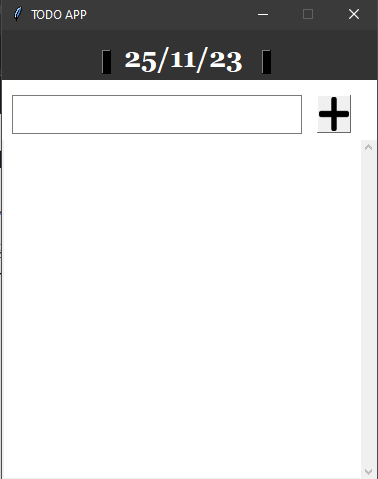
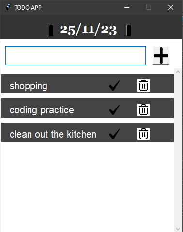
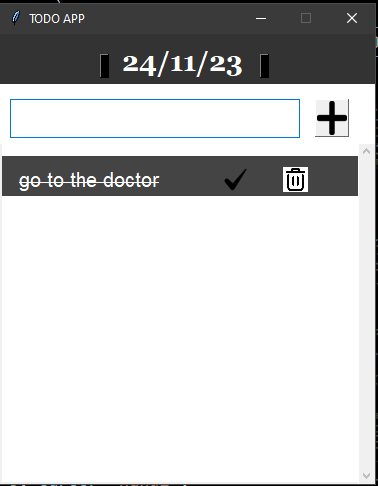

# TodoApp

A simple desktop ToDo application built with Python and Tkinter.

## Features

- Add, and delete tasks.
- Mark tasks as completed.
- User-friendly graphical interface.
- Local storage for task persistence.

## Screenshots

Include screenshots or GIFs demonstrating the main features of your ToDo app.

- App Homepage

    

-   App Homepage

    


- Tasks from previous days marked as done

    


## Prerequisites

Make sure you have Python installed on your machine. You can download Python from [python.org](https://www.python.org/downloads/).

## Installation

1. Clone the repository:

    ```bash
    git clone https://github.com/your-username/todo-desktop-app.git
    ```

2. Navigate to the project directory:

    ```bash
    cd TodoApp
    ```

3. Install dependencies:

    ```bash
    pip install -r requirements.txt
    ```

## Usage

Run the app using the following command:

    ```
    python main.py
    ```

## How to Use

Adding a Task:

- Enter the task details in the textbox"
- Click on the "Add Task" button.

Completing a Task:

- Click on the mark icon next to a task to mark it as completed.

Deleting a Task:

- click on the "Delete" icon corresponsing to the task to be deleted.

Viewing tasks from previous days:

- click on the buttons beside the dates to switch dates to see previous tasks or create tasks for a latter day

## Contributing

Feel free to contribute to the project. If you have suggestions or find bugs, please open an issue.

